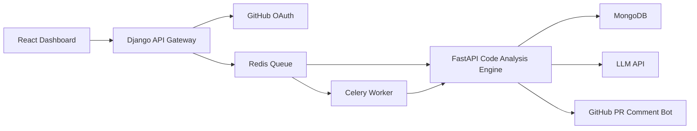
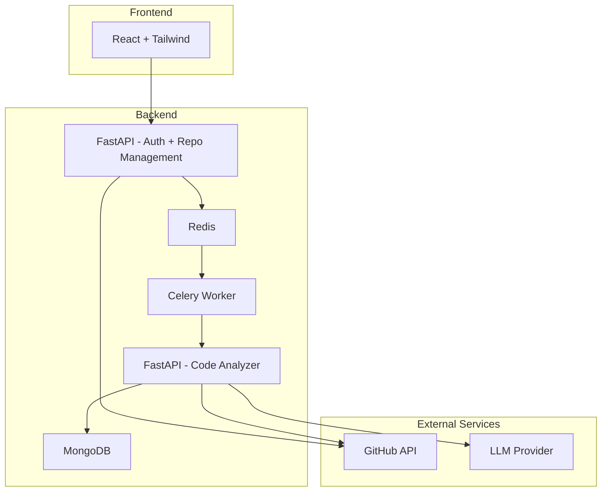

# AI Code Review & Technical Debt Analyzer


> AI-powered code review assistant that detects code smells, security risks, and technical debt — and automatically comments on Pull Requests.

---

# Problem

- Low-quality code gets merged
- Security issues go unnoticed
- Technical debt accumulates silently
- Manual code reviews are slow and inconsistent

---

# Solution

An intelligent, distributed system that:

- Connects to GitHub repositories
- Analyzes Pull Requests or commits
- Detects code smells & security risks
- Calculates technical debt score
- Generates AI review comments
- Automatically comments on PRs
- Produces quality badges

---

# System Architecture

## High-Level Architecture



---

## Microservices Architecture



---

# Intelligence Layer

## 1️ Static Code Analysis

- AST parsing (Python)
- Cyclomatic complexity
- Nesting depth
- LOC analysis
- Code duplication detection
- Hardcoded secret detection
- Pattern-based smell detection

---

## 2️ LLM-Based Smart Review

Each function is analyzed by an LLM for:

- Code smells
- Security risks
- Optimization opportunities
- Refactoring suggestions
- Maintainability improvements

Structured JSON output ensures consistency.

---

## 3️ ML-Based Risk Scoring

Model classifies code as:

- Clean
- Moderate Risk
- High Risk

Features used:

- Cyclomatic complexity
- Lines of code
- Security keyword density
- AI-detected smell count
- Dependency depth

Outputs:

- Technical Debt Score (0–10)
- Security Score
- Quality Grade (A–F)

---

# GitHub Integration

- GitHub OAuth authentication
- Pull Request scanning
- Inline AI review comments
- Status check reporting
- README quality badge generation
- Webhook automation

---

# Example Output

```json
{
  "file": "auth.py",
  "cyclomatic_complexity": 18,
  "security_score": 0.72,
  "ai_comments": [
    "Function login() is too complex",
    "Possible SQL injection risk",
    "Consider extracting validation logic"
  ],
  "technical_debt_score": 7.4,
  "quality_grade": "B"
}
```

---

# Database Schema (MongoDB)

```json
{
  "repo": "ai-reviewer",
  "branch": "main",
  "commit_sha": "abc123",
  "analysis_type": "PR",
  "timestamp": "ISODate",
  "files": [],
  "total_debt_score": 7.8,
  "security_score": 0.6,
  "quality_grade": "B"
}
```

---

# Dashboard Features

- Repository overview
- Technical debt trend
- Security trend
- Complexity heatmap
- PR drilldown analysis
- Organization-level analytics

---

# Tech Stack

### Frontend
- React
- TailwindCSS

### Backend
- Django (Auth + GitHub OAuth)
- FastAPI (Code Analysis Engine)
- Celery
- Redis
- MongoDB

### AI & ML
- LLM API integration
- AST parsing
- Scikit-learn (Risk Scoring Model)

### DevOps
- Docker
- Docker Compose
- Kubernetes
- CI/CD Integration

---

# Local Development

```bash
git clone https://github.com/yourusername/ai-code-reviewer.git
cd ai-code-reviewer
cp .env.example .env
docker-compose up --build
```

Open:

```
http://localhost:3000
```

---

# Production Deployment

- Kubernetes cluster deployment
- Horizontal Pod Autoscaling
- Queue-based distributed processing
- GitHub webhook automation
- CI/CD pipeline integration

---

# Advanced Features

- Automatic PR inline comments
- AI-generated refactoring suggestions
- CI/CD failure thresholds
- Code Quality Badge generation
- Multi-repository support
- Developer performance insights

---

# Roadmap

- [ ] Multi-language support (Python, JS, Java)
- [ ] Semantic code similarity detection
- [ ] AI-generated auto-refactor PRs
- [ ] Slack integration
- [ ] IDE extension

---

# Why This Project Is Powerful

This project demonstrates:

- Distributed microservices architecture
- Asynchronous task processing
- OAuth integration
- Static code analysis engineering
- LLM-based contextual reasoning
- ML risk scoring model
- Scalable infrastructure design
- Production containerization
- DevOps best practices

---

# License

MIT License
